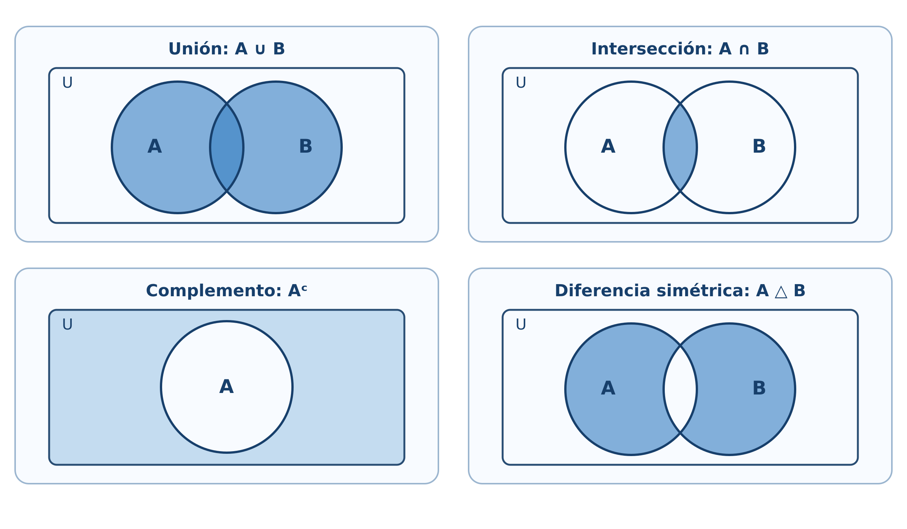
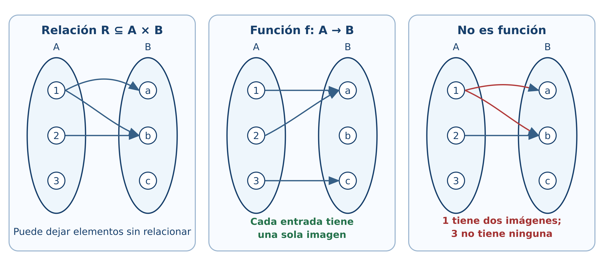
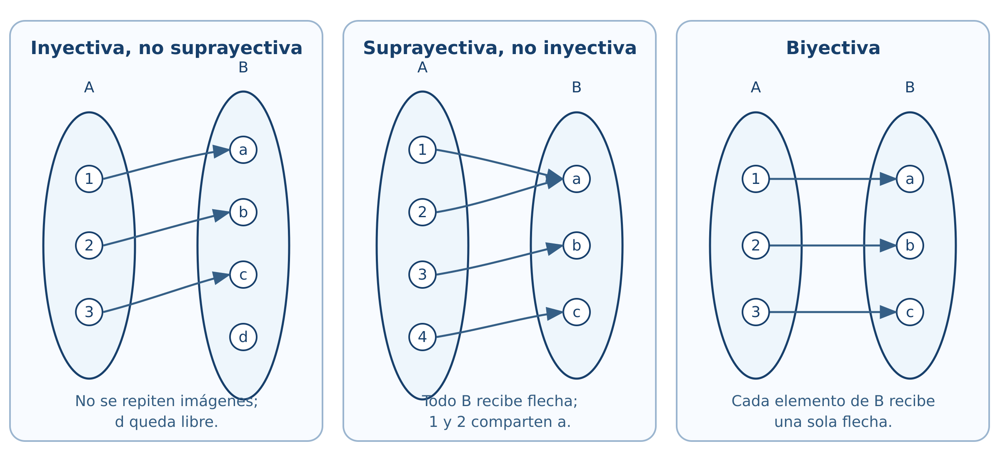

# Lógica y conjuntos

*Experimentación con R, GeoGebra y circuitos*

## Introducción {.unnumbered}

Este capítulo transforma los conceptos de lógica y conjuntos en objetos que pueden calcularse, visualizarse y comprobarse. Cada bloque parte de una idea matemática, la resuelve manualmente y después utiliza R como laboratorio. GeoGebra se reservará para las representaciones dinámicas y Shiny para actividades en las que el estudiante modifique datos y reciba retroalimentación.

El código inicial utiliza R base [@rCore2026]. De esta forma puede ejecutarse en RStudio o en el cuaderno de Google Colab sin instalar paquetes.

::: {.callout-tip title="Cuaderno completo y ejecutable"}
El cuaderno reúne las nueve secciones, las aplicaciones a sistemas digitales, visualizaciones en R y ejercicios de comprobación. Puede abrirse en Colab o descargarse para conservar una copia local.

[Abrir en Google Colab](https://colab.research.google.com/github/gilbertorodriguez59/libro-algebra-superior-r-geogebra-dev/blob/main/notebooks/capitulo-01-logica-conjuntos-R.ipynb){.btn .btn-primary target="_blank"} [Descargar el cuaderno](notebooks/capitulo-01-logica-conjuntos-R.ipynb){.btn target="_blank"}
:::

### Objetivos {.unnumbered}

Al finalizar, el lector podrá:

- representar conjuntos finitos mediante vectores de R;
- construir tablas de verdad;
- evaluar proposiciones abiertas sobre dominios finitos;
- comprobar equivalencias lógicas y leyes de conjuntos;
- resolver problemas de inclusión-exclusión;
- representar productos cartesianos, relaciones y funciones;
- clasificar funciones finitas;
- experimentar con correspondencias biyectivas;
- comprobar simplificaciones booleanas y diseñar circuitos.

## Lenguaje de conjuntos

### Situación inicial {.unnumbered}

Consideremos el universo

$$
U=\{1,2,\ldots,10\},
$$

el conjunto $A$ de números pares y el conjunto $B$ de números primos en $U$:

$$
A=\{2,4,6,8,10\},\qquad B=\{2,3,5,7\}.
$$

En R, un conjunto finito puede representarse mediante un vector sin elementos repetidos.

~~~{r}
U <- 1:10
A <- c(2, 4, 6, 8, 10)
B <- c(2, 3, 5, 7)

A
B
~~~

El operador **%in%** comprueba pertenencia.

~~~{r}
4 %in% A
5 %in% A
A %in% B
~~~

Para comprobar $A\subseteq B$, no basta que algún elemento pertenezca; todos deben pertenecer:

~~~{r}
es_subconjunto <- function(X, Y) {
  all(X %in% Y)
}

es_subconjunto(c(2, 4), A)
es_subconjunto(A, B)
~~~

La igualdad de conjuntos debe ignorar el orden:

~~~{r}
setequal(c(1, 2, 3), c(3, 2, 1))
identical(c(1, 2, 3), c(3, 2, 1))
~~~

La función **setequal()** devuelve verdadero, mientras que **identical()** devuelve falso, porque esta última compara vectores ordenados, no conjuntos.

### Conjunto potencia {.unnumbered}

El siguiente código genera todos los subconjuntos de un conjunto finito:

~~~{r}
conjunto_potencia <- function(A) {
  resultado <- list(A[FALSE])
  if (length(A) > 0) {
    for (k in seq_len(length(A))) {
      resultado <- c(
        resultado,
        combn(A, k, simplify = FALSE)
      )
    }
  }
  resultado
}

P <- conjunto_potencia(c("a", "b", "c"))
P
length(P)
~~~

El resultado contiene $2^3=8$ subconjuntos, incluido el conjunto vacío.

::: {.callout-note title="GeoGebra: actividad prevista"}
Se construirá una mesa dinámica con los ocho subconjuntos de $\{a,b,c\}$. El estudiante podrá seleccionar dos subconjuntos y observar su unión, intersección y diferencia simétrica. El enlace se incorporará cuando la actividad esté publicada.
:::

## Proposiciones y conectivos lógicos

### Construcción de una tabla de verdad {.unnumbered}

R representa verdadero y falso mediante **TRUE** y **FALSE**. Las combinaciones para dos proposiciones se generan así:

~~~{r}
tabla <- expand.grid(
  q = c(TRUE, FALSE),
  p = c(TRUE, FALSE)
)[, c("p", "q")]

implica <- function(p, q) {
  (!p) | q
}

tabla$no_p <- !tabla$p
tabla$p_y_q <- tabla$p & tabla$q
tabla$p_o_q <- tabla$p | tabla$q
tabla$p_implica_q <- implica(tabla$p, tabla$q)
tabla$p_sii_q <- tabla$p == tabla$q

tabla
~~~

La implicación se implementa mediante la equivalencia

$$
p\Rightarrow q\equiv\neg p\lor q.
$$

### Tautologías, contradicciones y contingencias {.unnumbered}

Una expresión es tautología si todas sus filas son verdaderas:

~~~{r}
es_tautologia <- function(valores) all(valores)
es_contradiccion <- function(valores) all(!valores)

tercero_excluido <- tabla$p | !tabla$p
contradiccion <- tabla$p & !tabla$p

es_tautologia(tercero_excluido)
es_contradiccion(contradiccion)
~~~

Para comprobar

$$
p\Rightarrow(q\land r)
\equiv
(p\Rightarrow q)\land(p\Rightarrow r),
$$

generamos las ocho combinaciones posibles:

~~~{r}
t3 <- expand.grid(
  r = c(TRUE, FALSE),
  q = c(TRUE, FALSE),
  p = c(TRUE, FALSE)
)[, c("p", "q", "r")]

izquierda <- implica(t3$p, t3$q & t3$r)
derecha <- implica(t3$p, t3$q) & implica(t3$p, t3$r)

data.frame(t3, izquierda, derecha, equivalentes = izquierda == derecha)
all(izquierda == derecha)
~~~

La última instrucción devuelve verdadero; la equivalencia se cumple en todas las filas.

### Interactivo: tabla de verdad {.unnumbered}

Cambie la expresión y los valores de entrada. La fila activa se señala en la tabla y la salida se actualiza inmediatamente.

[Abrir el laboratorio de tablas de verdad](interactivos/tablas-verdad.html){.btn .btn-primary target="_blank"}

::: {.content-visible when-format="html"}
<iframe class="interactive-frame truth" src="interactivos/tablas-verdad.html" title="Laboratorio interactivo de tablas de verdad" loading="lazy"></iframe>
:::

## Cuantificadores y equivalencias lógicas

### Proposiciones abiertas sobre dominios finitos {.unnumbered}

Sea

$$
D=\{-4,-3,\ldots,4\}
$$

y sea $p(x):x^2\le 4$. Su conjunto solución se obtiene filtrando el dominio:

~~~{r}
D <- -4:4
p <- D^2 <= 4

data.frame(x = D, p_x = p)
D[p]
~~~

El conjunto solución es $\{-2,-1,0,1,2\}$.

En un dominio finito, **all()** representa el cuantificador universal y **any()** el existencial:

~~~{r}
all(D^2 >= 0)  # para todo x en D, x^2 >= 0
any(D^2 == 4)  # existe x en D tal que x^2 = 4
~~~

::: {.callout-warning title="Límite de la comprobación computacional"}
Verificar una propiedad en muchos valores no demuestra que se cumpla para todos los números reales. R sí puede decidir un cuantificador sobre un dominio finito completamente enumerado. Para dominios infinitos, la demostración matemática sigue siendo indispensable.
:::

### Negación de cuantificadores {.unnumbered}

La equivalencia

$$
\neg(\forall x\in D\,p(x))
\equiv
\exists x\in D\,\neg p(x)
$$

se comprueba con:

~~~{r}
lado_izquierdo <- !all(p)
lado_derecho <- any(!p)

c(lado_izquierdo, lado_derecho)
~~~

No estamos sustituyendo una demostración formal; estamos observando la equivalencia en el dominio elegido.

## Operaciones y propiedades de los conjuntos

### Operaciones en R {.unnumbered}

R incluye funciones directas para unión, intersección y diferencia.

~~~{r}
union(A, B)
intersect(A, B)
setdiff(A, B)
setdiff(B, A)
~~~

El complemento depende del universo:

~~~{r}
complemento <- function(X, U) {
  setdiff(U, X)
}

complemento(A, U)
~~~

La diferencia simétrica es

$$
A\triangle B=(A\setminus B)\cup(B\setminus A).
$$

~~~{r}
diferencia_simetrica <- function(X, Y) {
  union(setdiff(X, Y), setdiff(Y, X))
}

diferencia_simetrica(A, B)
~~~

{#fig-venn-aplicado width=96%}

### Interactivo: operaciones de conjuntos {.unnumbered}

Seleccione una operación y modifique los elementos de $A$ y $B$. El laboratorio calcula el conjunto resultante, su cardinalidad y la región correspondiente.

[Abrir el laboratorio de conjuntos](interactivos/operaciones-conjuntos.html){.btn .btn-primary target="_blank"}

::: {.content-visible when-format="html"}
<iframe class="interactive-frame" src="interactivos/operaciones-conjuntos.html" title="Laboratorio interactivo de operaciones con conjuntos" loading="lazy"></iframe>
:::

### Comprobación de las leyes de De Morgan {.unnumbered}

Para los conjuntos concretos $A,B\subseteq U$, comprobamos

$$
(A\cup B)^c=A^c\cap B^c.
$$

~~~{r}
lado_izquierdo <- complemento(union(A, B), U)
lado_derecho <- intersect(
  complemento(A, U),
  complemento(B, U)
)

lado_izquierdo
lado_derecho
setequal(lado_izquierdo, lado_derecho)
~~~

::: {.callout-note title="Del interactivo a la demostración"}
El laboratorio permite anticipar que $(A\cup B)^c$ y $A^c\cap B^c$ sombrean la misma región. La comprobación con R verifica el universo finito elegido; la demostración general se realiza mediante pertenencia.
:::

## Cardinalidad de conjuntos finitos y problemas de conteo

### Inclusión-exclusión con dos conjuntos {.unnumbered}

En un grupo de $180$ estudiantes, $95$ usan R, $80$ usan Python y $40$ utilizan ambos lenguajes.

~~~{r}
total <- 180
n_R <- 95
n_Python <- 80
n_ambos <- 40

n_al_menos_uno <- n_R + n_Python - n_ambos
n_ninguno <- total - n_al_menos_uno

c(al_menos_uno = n_al_menos_uno, ninguno = n_ninguno)
~~~

### Inclusión-exclusión con tres conjuntos {.unnumbered}

~~~{r}
inclusion_exclusion_3 <- function(nA, nB, nC,
                                 nAB, nAC, nBC, nABC) {
  nA + nB + nC - nAB - nAC - nBC + nABC
}

total_dispositivos <- 400
al_menos_un_sensor <- inclusion_exclusion_3(
  nA = 170, nB = 150, nC = 140,
  nAB = 70, nAC = 60, nBC = 50,
  nABC = 20
)

ningun_sensor <- total_dispositivos - al_menos_un_sensor
c(al_menos_un_sensor, ningun_sensor)
~~~

### Interpretación {.unnumbered}

R no decide qué significa cada intersección. El lector debe identificar si los datos de dos conjuntos incluyen o excluyen la intersección triple. El código ejecuta correctamente una fórmula solo cuando la modelación es correcta.

## Producto cartesiano y relaciones

### Producto cartesiano como tabla {.unnumbered}

Sean $A=\{1,2\}$ y $B=\{x,y,z\}$. El producto $A\times B$ se genera con **expand.grid()**:

~~~{r}
A1 <- c(1, 2)
B1 <- c("x", "y", "z")

AxB <- expand.grid(a = A1, b = B1)
AxB
nrow(AxB)
~~~

El número de filas confirma $|A\times B|=|A||B|=6$.

### Comprobación de una identidad {.unnumbered}

Verifiquemos

$$
A\times(B\cup C)=(A\times B)\cup(A\times C).
$$

Para comparar pares ordenados utilizaremos una clave de texto.

~~~{r}
clave_par <- function(x, y) paste(x, y, sep = "|")

producto_cartesiano <- function(X, Y) {
  pares <- expand.grid(x = X, y = Y)
  clave_par(pares$x, pares$y)
}

A2 <- c(1, 2)
B2 <- c("b1", "b2")
C2 <- c("c1", "c2")

izquierda <- producto_cartesiano(A2, union(B2, C2))
derecha <- union(
  producto_cartesiano(A2, B2),
  producto_cartesiano(A2, C2)
)

setequal(izquierda, derecha)
~~~

### Propiedades de una relación finita {.unnumbered}

Representemos una relación mediante dos columnas:

~~~{r}
X <- c(1, 2, 3)
R <- data.frame(
  x = c(1, 1, 2, 3),
  y = c(1, 2, 2, 3)
)
R
~~~

Las siguientes funciones analizan reflexividad, simetría, antisimetría y transitividad.

~~~{r}
claves_relacion <- function(R) clave_par(R$x, R$y)

es_reflexiva <- function(R, X) {
  all(clave_par(X, X) %in% claves_relacion(R))
}

es_simetrica <- function(R) {
  all(clave_par(R$y, R$x) %in% claves_relacion(R))
}

es_antisimetrica <- function(R) {
  reversos <- clave_par(R$y, R$x) %in% claves_relacion(R)
  all((R$x == R$y) | !reversos)
}

es_transitiva <- function(R) {
  claves <- claves_relacion(R)
  for (i in seq_len(nrow(R))) {
    for (j in seq_len(nrow(R))) {
      if (R$y[i] == R$x[j]) {
        if (!(clave_par(R$x[i], R$y[j]) %in% claves)) {
          return(FALSE)
        }
      }
    }
  }
  TRUE
}

c(
  reflexiva = es_reflexiva(R, X),
  simetrica = es_simetrica(R),
  antisimetrica = es_antisimetrica(R),
  transitiva = es_transitiva(R)
)
~~~

{#fig-relacion-funcion-aplicado width=98%}

::: {.callout-tip title="Interpretación"}
El programa comprueba una relación finita completamente especificada. La razón matemática de cada propiedad sigue siendo la definición; el código automatiza la revisión de los pares.
:::

## Funciones: definición, representación y operaciones

### Una función como tabla {.unnumbered}

Sobre conjuntos finitos, una función puede representarse por una tabla de entradas y salidas.

~~~{r}
dominio <- c("s1", "s2", "s3")
codominio <- c("bajo", "medio", "alto")

f_tabla <- data.frame(
  x = dominio,
  y = c("bajo", "alto", "medio")
)

f_tabla
~~~

Una tabla representa una función si:

1. cada elemento del dominio aparece;
2. aparece exactamente una vez como entrada;
3. cada salida pertenece al codominio.

~~~{r}
es_funcion <- function(tabla, dominio, codominio) {
  entradas_correctas <- setequal(tabla$x, dominio)
  entradas_unicas <- !anyDuplicated(tabla$x)
  salidas_validas <- all(tabla$y %in% codominio)

  entradas_correctas && entradas_unicas && salidas_validas
}

es_funcion(f_tabla, dominio, codominio)
~~~

### Funciones dadas por fórmulas {.unnumbered}

~~~{r}
f <- function(x) 2 * x + 1
g <- function(x) x^2

g_comp_f <- function(x) g(f(x))
f_comp_g <- function(x) f(g(x))

x <- -3:3
data.frame(
  x,
  g_comp_f = g_comp_f(x),
  f_comp_g = f_comp_g(x)
)
~~~

Las columnas no coinciden: en general $g\circ f\ne f\circ g$.

{#fig-composicion-aplicada width=90%}

::: {.callout-note title="GeoGebra: composición prevista"}
Se mostrarán simultáneamente las gráficas de $f$, $g$, $g\circ f$ y $f\circ g$. Un deslizador permitirá seguir un valor $x$ desde el dominio, pasar por la salida de la primera función y llegar a la composición.
:::

## Funciones inyectivas, suprayectivas y biyectivas

### Clasificación automática de funciones finitas {.unnumbered}

~~~{r}
clasificar_funcion <- function(tabla, dominio, codominio) {
  if (!es_funcion(tabla, dominio, codominio)) {
    return(data.frame(
      es_funcion = FALSE,
      inyectiva = NA,
      suprayectiva = NA,
      biyectiva = NA
    ))
  }

  inyectiva <- !anyDuplicated(tabla$y)
  suprayectiva <- setequal(unique(tabla$y), codominio)

  data.frame(
    es_funcion = TRUE,
    inyectiva = inyectiva,
    suprayectiva = suprayectiva,
    biyectiva = inyectiva && suprayectiva
  )
}

clasificar_funcion(f_tabla, dominio, codominio)
~~~

Probemos ahora una función que repite una salida:

~~~{r}
h_tabla <- data.frame(
  x = dominio,
  y = c("bajo", "bajo", "medio")
)

clasificar_funcion(h_tabla, dominio, codominio)
~~~

No es inyectiva porque dos entradas producen “bajo”, y no es suprayectiva porque “alto” no aparece como imagen.

{#fig-tipos-funciones-aplicado width=98%}

### Interactivo: clasificador de funciones {.unnumbered}

Modifique las tres imágenes, deje alguna entrada sin imagen o asigne dos imágenes al elemento $1$. El diagnóstico distingue la definición de función de las propiedades de inyectividad, suprayectividad y biyección.

[Abrir el clasificador de funciones](interactivos/clasificador-funciones.html){.btn .btn-primary target="_blank"}

::: {.content-visible when-format="html"}
<iframe class="interactive-frame functions" src="interactivos/clasificador-funciones.html" title="Clasificador interactivo de funciones finitas" loading="lazy"></iframe>
:::

## Cardinalidad, equipotencia y conjuntos infinitos

### Una biyección entre $\mathbb N_0$ y $\mathbb Z$ {.unnumbered}

Definimos

$$
\phi(n)=
\begin{cases}
0, & n=0,\\
(n+1)/2, & n\text{ impar},\\
-n/2, & n\text{ par y }n>0.
\end{cases}
$$

~~~{r}
phi <- function(n) {
  ifelse(
    n == 0,
    0,
    ifelse(n %% 2 == 1, (n + 1) / 2, -n / 2)
  )
}

n <- 0:16
data.frame(n, phi_n = phi(n))
~~~

La salida comienza

$$
0,1,-1,2,-2,3,-3,\ldots
$$

y muestra cómo los enteros pueden enumerarse mediante los naturales.

::: {.callout-warning title="Qué demuestra y qué no demuestra el experimento"}
La tabla solo muestra los primeros valores. La biyección se justifica demostrando que cada entero aparece exactamente una vez; observar muchos casos sirve para comprender el patrón, no para sustituir la prueba.
:::

## Aplicación integradora: álgebra de Boole y circuitos {.unnumbered}

La secuencia práctica adapta el capítulo 3 de @tocci2003: variables booleanas, tablas de verdad, compuertas OR, AND y NOT, traducción entre circuitos y expresiones, evaluación de salidas, NAND/NOR, De Morgan, universalidad y diagramas de temporización.

### Compuertas básicas en R {.unnumbered}

~~~{r}
NOT <- function(a) !a
OR  <- function(a, b) a | b
AND <- function(a, b) a & b
NOR <- function(a, b) !(a | b)
NAND <- function(a, b) !(a & b)

entradas_basicas <- expand.grid(
  b = c(TRUE, FALSE),
  a = c(TRUE, FALSE)
)[, c("a", "b")]

data.frame(
  entradas_basicas,
  OR = OR(entradas_basicas$a, entradas_basicas$b),
  AND = AND(entradas_basicas$a, entradas_basicas$b),
  NOR = NOR(entradas_basicas$a, entradas_basicas$b),
  NAND = NAND(entradas_basicas$a, entradas_basicas$b)
)
~~~

### De circuito a expresión y de expresión a circuito {.unnumbered}

Para analizar un diagrama:

1. se identifican entradas, salidas y polaridades activas;
2. se asigna una variable intermedia a la salida de cada compuerta;
3. se escribe la expresión de cada etapa de izquierda a derecha;
4. se sustituye hasta obtener la salida en función de las entradas;
5. se comprueba el resultado mediante una tabla de verdad.

Para implantar una expresión se realiza el proceso inverso. Por ejemplo,

$$
X=(A+\overline B)\,C
$$

requiere invertir $B$, formar $A+\overline B$ con OR y combinar el resultado con $C$ mediante AND.

::: {.callout-note title="Figuras previstas"}
El libro incorporará figuras propias con símbolos lógicos estándar. Cada ejemplo mostrará cuatro representaciones coordinadas: expresión, tabla de verdad, circuito y diagrama de temporización. No se reutilizarán las ilustraciones del texto de referencia.
:::

### Comprobación de una simplificación {.unnumbered}

Estudiemos

$$
F=\overline a\,b+a b+a\overline b.
$$

Algebraicamente,

$$
\begin{aligned}
F
&=b(\overline a+a)+a\overline b\\
&=b+a\overline b\\
&=(b+a)(b+\overline b)\\
&=a+b.
\end{aligned}
$$

R comprueba la igualdad en las cuatro combinaciones:

~~~{r}
tv <- expand.grid(
  b = c(TRUE, FALSE),
  a = c(TRUE, FALSE)
)[, c("a", "b")]

F_original <- (!tv$a & tv$b) |
              (tv$a & tv$b) |
              (tv$a & !tv$b)

F_simplificada <- tv$a | tv$b

data.frame(
  tv,
  F_original,
  F_simplificada,
  iguales = F_original == F_simplificada
)

all(F_original == F_simplificada)
~~~

### Universalidad de NOR y NAND {.unnumbered}

~~~{r}
nor <- function(x, y) !(x | y)

no_con_nor <- function(x) nor(x, x)
o_con_nor <- function(x, y) nor(nor(x, y), nor(x, y))
y_con_nor <- function(x, y) nor(nor(x, x), nor(y, y))

entradas <- expand.grid(
  b = c(TRUE, FALSE),
  a = c(TRUE, FALSE)
)[, c("a", "b")]

data.frame(
  entradas,
  NOT_a = no_con_nor(entradas$a),
  OR_ab = o_con_nor(entradas$a, entradas$b),
  AND_ab = y_con_nor(entradas$a, entradas$b)
)
~~~

La misma comprobación puede realizarse con NAND:

~~~{r}
nand <- function(x, y) !(x & y)

no_con_nand <- function(x) nand(x, x)
y_con_nand <- function(x, y) nand(nand(x, y), nand(x, y))
o_con_nand <- function(x, y) nand(nand(x, x), nand(y, y))

data.frame(
  entradas,
  NOT_a = no_con_nand(entradas$a),
  OR_ab = o_con_nand(entradas$a, entradas$b),
  AND_ab = y_con_nand(entradas$a, entradas$b)
)
~~~

### Señales activas en alto y en bajo {.unnumbered}

Una señal activa en alto realiza su función cuando vale $1$; una activa en bajo la realiza cuando vale $0$. En un nombre de señal, la barra superior puede indicar activación en bajo. En un símbolo lógico, una burbuja indica inversión o terminal activa en bajo.

~~~{r}
habilitada_alta <- c(FALSE, TRUE, FALSE, TRUE)
habilitada_baja <- !habilitada_alta

data.frame(
  nivel_entrada = as.integer(habilitada_alta),
  activa_en_alto = habilitada_alta,
  activa_en_bajo = habilitada_baja
)
~~~

::: {.callout-warning title="Modelo lógico frente a circuito físico"}
En R, cero y uno se modelan como estados lógicos. En el dispositivo real corresponden a intervalos de voltaje definidos por su tecnología. El modelo de este capítulo no incluye todavía márgenes de ruido ni retardos de propagación.
:::

### Formas de onda lógicas {.unnumbered}

El siguiente ejemplo genera señales binarias y calcula las salidas AND y OR.

~~~{r}
t <- 0:8
senal_A <- c(0, 0, 1, 1, 1, 0, 1, 1, 0)
senal_B <- c(1, 1, 1, 0, 0, 1, 0, 0, 0)

salida_AND <- as.integer(as.logical(senal_A) & as.logical(senal_B))
salida_OR <- as.integer(as.logical(senal_A) | as.logical(senal_B))

matplot(
  t,
  cbind(senal_A, senal_B, salida_AND, salida_OR),
  type = "s",
  lty = 1,
  lwd = 2,
  xlab = "Tiempo",
  ylab = "Nivel lógico",
  yaxt = "n",
  col = c("#1f77b4", "#d62728", "#2ca02c", "#9467bd")
)
axis(2, at = c(0, 1))
legend(
  "topright",
  legend = c("A", "B", "A AND B", "A OR B"),
  col = c("#1f77b4", "#d62728", "#2ca02c", "#9467bd"),
  lty = 1,
  lwd = 2,
  bty = "n"
)
~~~

::: {.callout-note title="GeoGebra: circuitos y formas de onda"}
El recurso previsto permitirá accionar interruptores para $A$, $B$ y $C$, observar la salida del circuito y comparar el resultado con la fila correspondiente de la tabla de verdad. Otro recurso permitirá mover los instantes de conmutación y observar las formas de onda. Las compuertas se presentarán con símbolos uniformes basados en la convención IEEE/ANSI estudiada por @tocci2003.
:::

## Laboratorio del capítulo {.unnumbered}

La primera versión integra tres aplicaciones que funcionan directamente en el sitio estático, sin servidor ni instalación adicional:

1. **Constructor de tablas de verdad:** selección de conectivos y clasificación como tautología, contradicción o contingencia.
2. **Operaciones de conjuntos:** regiones de Venn, cardinalidad e inclusión-exclusión.
3. **Clasificador de funciones:** diagramas sagitales y diagnóstico de inyectividad, suprayectividad y biyectividad.

El **simulador de circuitos**, con compuertas, polaridades y diagramas de temporización, será la siguiente ampliación. Más adelante se preparará una versión Shiny o Shinylive cuando aporte controles que no convenga resolver en el navegador.

## Ejercicios con R {.unnumbered}

1. Modifique $U,A,B$ y compruebe ambas leyes de De Morgan.
2. Construya la tabla de verdad de $[(p\land\neg q)\Rightarrow(r\land\neg r)]\Leftrightarrow(p\Rightarrow q)$.
3. Escriba una función que determine si dos conjuntos finitos son disjuntos.
4. Extienda el programa de relaciones para indicar qué pares impiden la simetría o la transitividad.
5. Construya tres tablas: una función solo inyectiva, otra solo suprayectiva y una biyectiva.
6. Compruebe por tabla de verdad la ley de absorción $a+ab=a$.
7. Implemente NAND y demuestre computacionalmente que también es una compuerta universal.
8. Genere dos señales binarias propias y trace las salidas XOR y NOR.

## Proyecto integrador {.unnumbered}

Diseñe un sistema lógico de tres entradas relacionado con sensores electrónicos:

1. describa la regla de activación;
2. escriba su expresión booleana;
3. genere la tabla de verdad en R;
4. simplifique la expresión manualmente;
5. compruebe la simplificación con R;
6. dibuje los circuitos original y simplificado;
7. genere una forma de onda de prueba;
8. interprete la reducción en el número de compuertas.

## Recursos interactivos y multimedia {.unnumbered}

Esta versión ya incorpora:

- cuaderno completo del capítulo para Google Colab con R;
- laboratorio de tablas de verdad;
- laboratorio de operaciones con conjuntos y diagramas de Venn;
- clasificador de funciones mediante diagramas sagitales;
- figuras vectoriales para operaciones, relaciones, composición y tipos de funciones.

En versiones posteriores se incorporarán:

- video introductorio sobre lógica y conjuntos;
- video de tablas de verdad y cuantificadores;
- video de simplificación booleana y universalidad de NAND/NOR;
- presentación docente;
- infografía de correspondencia lógica-conjuntos;
- infografía de funciones y sus clasificaciones;
- infografía de errores frecuentes;
- actividades de GeoGebra y simulador de circuitos.

## Síntesis {.unnumbered}

R permite experimentar con conjuntos finitos, tablas de verdad, relaciones y funciones. Las comprobaciones exhaustivas son concluyentes cuando el dominio es finito y se han enumerado todos los casos. Para afirmaciones generales sobre conjuntos infinitos, la demostración matemática sigue siendo el fundamento.

## Referencias del capítulo {.unnumbered}

La secuencia temática sigue el programa de Álgebra Superior [@uaslp2011]. Los fundamentos se apoyan en @silvaLazo2007, @epp2011 y @rosen2019. La aplicación a compuertas y álgebra booleana adapta el capítulo 3 de @tocci2003. El código utiliza R base [@rCore2026].
