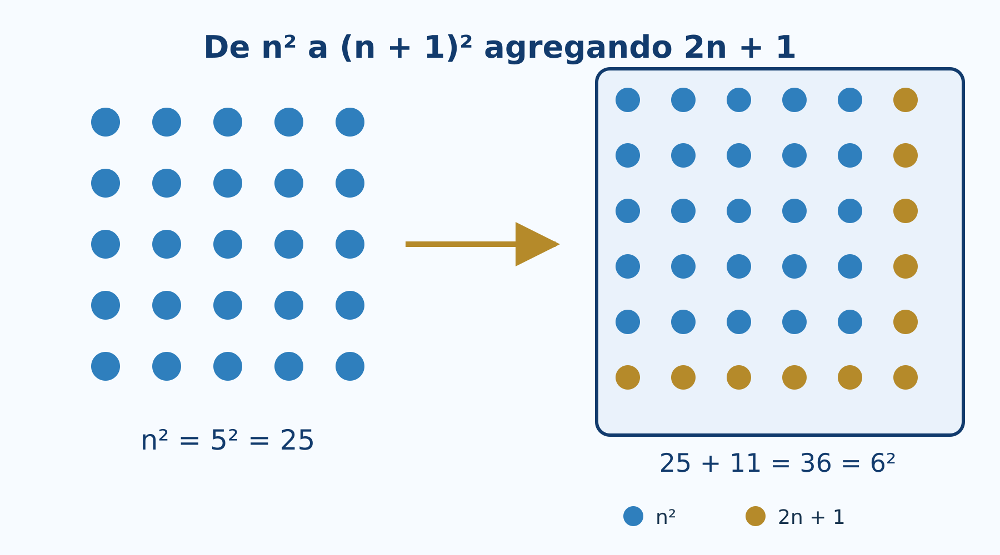
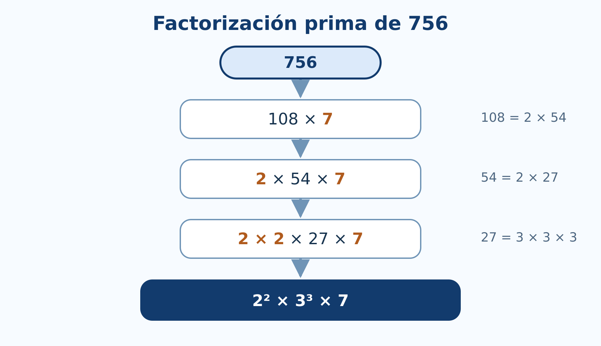
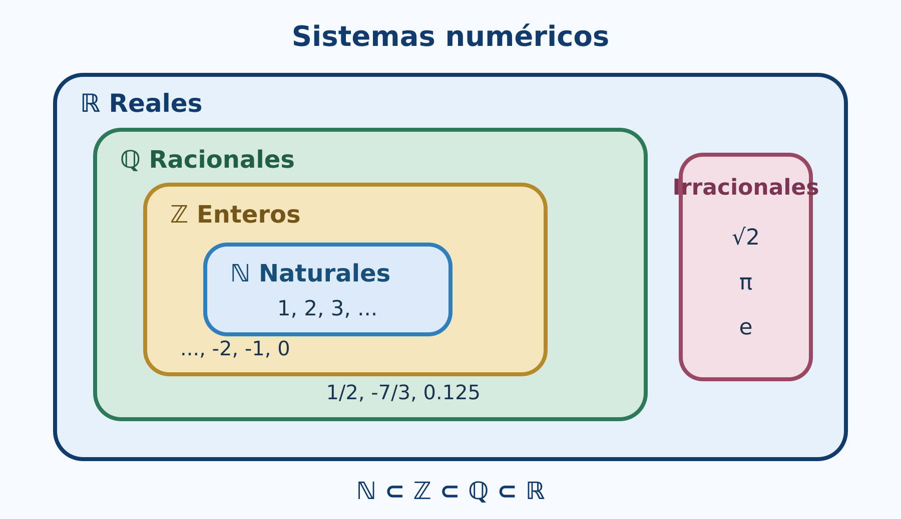

# Números enteros y reales

*Experimentación con R, algoritmos y recta numérica*

## Introducción {.unnumbered .unlisted}

Este capítulo convierte propiedades de los enteros y los reales en experimentos reproducibles. R permitirá generar ejemplos, ejecutar algoritmos, detectar patrones y visualizar distancias. La comprobación computacional será una herramienta para formular y revisar conjeturas; las afirmaciones para infinitos números continuarán requiriendo demostración.

Todo el código principal usa R base [@rCore2026]. Puede ejecutarse en RStudio o en Google Colab sin instalar paquetes.

::: {.callout-tip title="Cuaderno completo y ejecutable"}
El cuaderno sigue las secciones 2.1-2.8, incluye algoritmos de divisibilidad y primos, experimentos sobre precisión numérica y gráficas de exponentes y valor absoluto.

[Abrir en Google Colab](https://colab.research.google.com/github/gilbertorodriguez59/libro-algebra-superior-r-geogebra-dev/blob/main/notebooks/capitulo-02-enteros-reales-R.ipynb){.btn .btn-primary target="_blank"} [Descargar el cuaderno](notebooks/capitulo-02-enteros-reales-R.ipynb){.btn target="_blank"}
:::

### Objetivos {.unnumbered .unlisted}

Al finalizar, el lector podrá:

- representar enteros y operar con cociente y residuo en R;
- experimentar con sucesiones que se demuestran por inducción;
- programar los algoritmos de Euclides y Euclides extendido;
- detectar primos y obtener factorizaciones;
- distinguir cálculo exacto simbólico de aproximación numérica;
- explorar propiedades de orden y densidad en la recta real;
- evaluar potencias con exponentes enteros y racionales atendiendo a su dominio;
- resolver e interpretar inecuaciones con valor absoluto.

## Propiedades de los números enteros {#sec-propiedades-enteros}

### Enteros y almacenamiento en R {.unnumbered .unlisted}

R distingue valores enteros escritos con el sufijo `L` y valores numéricos almacenados, normalmente, en doble precisión.

~~~{r}
z <- c(-3L, -2L, -1L, 0L, 1L, 2L, 3L)

typeof(z)
typeof(3)
typeof(3L)
~~~

Para los ejemplos habituales ambos tipos producen las mismas operaciones. Sin embargo, una computadora representa un conjunto **finito** de valores; no contiene literalmente todos los elementos de $\mathbb Z$ ni de $\mathbb R$.

~~~{r}
.Machine$integer.max
.Machine$double.xmax
~~~

::: {.callout-warning title="Modelo matemático y representación computacional"}
Los enteros matemáticos no tienen cota superior. Los enteros almacenados en un tipo de computadora sí la tienen. Cuando un cálculo excede el rango o la precisión disponible, el resultado puede desbordarse o redondearse.
:::

### Comprobación de propiedades {.unnumbered .unlisted}

Elegimos tres enteros y comparamos ambos lados de las propiedades asociativa y distributiva.

~~~{r}
a <- -7L
b <- 5L
c <- 3L

data.frame(
  propiedad = c("asociativa de la suma", "distributiva"),
  izquierda = c((a + b) + c, a * (b + c)),
  derecha = c(a + (b + c), a * b + a * c)
)
~~~

La igualdad para estos valores es una **verificación**, no una demostración para todos los enteros.

### Orden en la recta numérica {.unnumbered .unlisted}

~~~{r}
x <- -6:6
plot(x, rep(0, length(x)), pch = 19,
     xlab = "entero", ylab = "", yaxt = "n",
     main = "Enteros en la recta numérica")
abline(h = 0, col = "gray50")
text(x, rep(0.08, length(x)), labels = x, cex = 0.8)
~~~

En la recta, $a<b$ significa que $a$ aparece a la izquierda de $b$. Sumar el mismo número traslada ambos puntos sin cambiar su orden.

## Inducción matemática {#sec-induccion}

### Explorar antes de demostrar {.unnumbered .unlisted}

Consideremos la conjetura

$$
1+3+\cdots +(2n-1)=n^2.
$$

R permite comparar ambos lados para los primeros valores.

~~~{r}
n <- 1:12
lado_izquierdo <- cumsum(2 * n - 1)
lado_derecho <- n^2

data.frame(
  n = n,
  suma_impares = lado_izquierdo,
  cuadrado = lado_derecho,
  diferencia = lado_izquierdo - lado_derecho
)
~~~

Que la columna `diferencia` sea cero sugiere la identidad, pero la demostración inductiva explica por qué se conserva al pasar de $n$ a $n+1$.

{#fig-induccion-impares width=88%}

### Función para revisar una identidad {.unnumbered .unlisted}

~~~{r}
revisar_identidad <- function(n_max = 50L) {
  n <- seq_len(n_max)
  izquierda <- cumsum(2 * n - 1)
  data.frame(
    n = n,
    izquierda = izquierda,
    derecha = n^2,
    coincide = izquierda == n^2
  )
}

resultado <- revisar_identidad(20L)
all(resultado$coincide)
~~~

### Interactivo: construir el siguiente cuadrado {.unnumbered .unlisted}

Seleccione $n$ y observe cómo $n^2$ puntos, más una franja de $2n+1$ puntos, forman $(n+1)^2$.

[Abrir el laboratorio de inducción](interactivos/induccion-impares.html){.btn .btn-primary target="_blank"}

::: {.content-visible when-format="html"}
<iframe class="interactive-frame induction" src="interactivos/induccion-impares.html" title="Construcción interactiva de la suma de números impares" loading="lazy"></iframe>
:::

### Lo que R no demuestra {.unnumbered .unlisted}

No existe una instrucción que enumere todos los naturales y termine. La prueba formal requiere:

1. comprobar el caso base;
2. suponer la fórmula para un entero arbitrario $k$;
3. deducir la fórmula para $k+1$.

R ayuda a encontrar errores y contraejemplos. Si una afirmación falla para algún valor ensayado, queda refutada; si no falla, todavía necesita demostración.

## Divisibilidad {#sec-divisibilidad}

### Cociente y residuo {.unnumbered .unlisted}

En R, `%/%` calcula el cociente entero y `%%` el residuo.

~~~{r}
a <- c(47L, -47L)
d <- 6L
q <- a %/% d
r <- a %% d

data.frame(
  a = a,
  d = d,
  q = q,
  r = r,
  reconstruccion = d * q + r
)
~~~

Observe que R elige el residuo de modo que $0\le r<d$ cuando $d>0$.

Una función de divisibilidad puede escribirse así:

~~~{r}
divide <- function(a, b) {
  if (a == 0) stop("El divisor no puede ser cero")
  b %% a == 0
}

c(`7 divide 42` = divide(7L, 42L),
  `7 divide 40` = divide(7L, 40L))
~~~

### Algoritmo de Euclides {.unnumbered .unlisted}

~~~{r}
euclides <- function(a, b) {
  a <- abs(as.integer(a))
  b <- abs(as.integer(b))
  pasos <- data.frame(
    dividendo = integer(), divisor = integer(),
    cociente = integer(), residuo = integer()
  )

  while (b != 0L) {
    q <- a %/% b
    r <- a %% b
    pasos <- rbind(
      pasos,
      data.frame(dividendo = a, divisor = b,
                 cociente = q, residuo = r)
    )
    a <- b
    b <- r
  }

  list(mcd = a, pasos = pasos)
}

resultado <- euclides(252L, 198L)
resultado$pasos
resultado$mcd
~~~

{#fig-algoritmo-euclides width=88%}

### Euclides extendido y coeficientes de Bézout {.unnumbered .unlisted}

~~~{r}
euclides_extendido <- function(a, b) {
  viejo_r <- as.integer(a); r <- as.integer(b)
  viejo_s <- 1L; s <- 0L
  viejo_t <- 0L; t <- 1L

  while (r != 0L) {
    q <- viejo_r %/% r
    aux <- viejo_r - q * r; viejo_r <- r; r <- aux
    aux <- viejo_s - q * s; viejo_s <- s; s <- aux
    aux <- viejo_t - q * t; viejo_t <- t; t <- aux
  }

  if (viejo_r < 0L) {
    viejo_r <- -viejo_r
    viejo_s <- -viejo_s
    viejo_t <- -viejo_t
  }
  c(mcd = viejo_r, x = viejo_s, y = viejo_t)
}

bezout <- euclides_extendido(252L, 198L)
bezout
252L * bezout["x"] + 198L * bezout["y"]
~~~

### Interactivo: residuos sucesivos {.unnumbered .unlisted}

Introduzca dos enteros positivos. El laboratorio muestra cada división y señala el último residuo no nulo.

[Abrir el algoritmo de Euclides](interactivos/algoritmo-euclides.html){.btn .btn-primary target="_blank"}

::: {.content-visible when-format="html"}
<iframe class="interactive-frame euclid" src="interactivos/algoritmo-euclides.html" title="Algoritmo de Euclides interactivo" loading="lazy"></iframe>
:::

## Números primos y factorización {#sec-primos-factorizacion}

### Prueba de primalidad por división {.unnumbered .unlisted}

Para decidir si $n$ es primo basta probar divisores hasta $\sqrt n$.

~~~{r}
es_primo <- function(n) {
  n <- as.integer(n)
  if (n < 2L) return(FALSE)
  if (n == 2L) return(TRUE)
  if (n %% 2L == 0L) return(FALSE)

  limite <- floor(sqrt(n))
  if (limite < 3L) return(TRUE)
  candidatos <- seq.int(3L, limite, by = 2L)
  !any(n %% candidatos == 0L)
}

sapply(1:30, es_primo)
(1:100)[sapply(1:100, es_primo)]
~~~

### Criba de Eratóstenes {.unnumbered .unlisted}

La criba elimina múltiplos y conserva los primos no mayores que un límite.

~~~{r}
criba <- function(n) {
  n <- as.integer(n)
  if (n < 2L) return(integer())
  primo <- rep(TRUE, n)
  primo[1] <- FALSE

  limite <- floor(sqrt(n))
  if (limite >= 2L) {
    for (p in 2:limite) {
      if (primo[p]) primo[seq.int(p * p, n, by = p)] <- FALSE
    }
  }
  which(primo)
}

criba(100L)
~~~

### Factorización por divisiones sucesivas {.unnumbered .unlisted}

~~~{r}
factorizar <- function(n) {
  n <- abs(as.integer(n))
  if (n < 2L) return(integer())
  factores <- integer()
  d <- 2L

  while (d * d <= n) {
    while (n %% d == 0L) {
      factores <- c(factores, d)
      n <- n %/% d
    }
    d <- if (d == 2L) 3L else d + 2L
  }
  if (n > 1L) factores <- c(factores, n)
  factores
}

factorizar(756L)
table(factorizar(756L))
~~~

{#fig-arbol-factorizacion width=82%}

### MCD y MCM {.unnumbered .unlisted}

~~~{r}
mcd <- function(a, b) euclides(a, b)$mcd
mcm <- function(a, b) {
  if (a == 0L || b == 0L) return(0L)
  abs(a %/% mcd(a, b) * b)
}

a <- 840L
b <- 378L
c(mcd = mcd(a, b), mcm = mcm(a, b), producto = a * b)
mcd(a, b) * mcm(a, b) == a * b
~~~

## Números racionales y números reales {#sec-racionales-reales}

### Representar una fracción exactamente {.unnumbered .unlisted}

R base representa `1/3` mediante una aproximación de punto flotante. Para conservar una fracción exacta podemos guardar numerador y denominador reducidos.

~~~{r}
fraccion <- function(num, den = 1L) {
  if (den == 0L) stop("El denominador no puede ser cero")
  num <- as.integer(num)
  den <- as.integer(den)
  if (den < 0L) { num <- -num; den <- -den }
  g <- mcd(abs(num), den)
  c(num = num %/% g, den = den %/% g)
}

fraccion(18L, 24L)
fraccion(-15L, -35L)
~~~

### Aproximación y precisión {.unnumbered .unlisted}

El conocido ejemplo siguiente muestra que una igualdad matemáticamente correcta puede no ser exacta en aritmética binaria de punto flotante.

~~~{r}
0.1 + 0.2
(0.1 + 0.2) == 0.3
all.equal(0.1 + 0.2, 0.3)
~~~

Para comparar resultados numéricos se utiliza una tolerancia:

~~~{r}
iguales_aprox <- function(x, y, tolerancia = 1e-12) {
  abs(x - y) <= tolerancia
}

iguales_aprox(0.1 + 0.2, 0.3)
~~~

### Racionales e irracionales en la recta {.unnumbered .unlisted}

~~~{r}
valores <- c(0, 1/2, sqrt(2), 3/2, sqrt(3), 2)
etiquetas <- c("0", "1/2", "sqrt(2)", "3/2", "sqrt(3)", "2")

plot(valores, rep(0, length(valores)), pch = 19,
     xlim = c(-0.1, 2.1), ylim = c(-0.35, 0.35),
     axes = FALSE, xlab = "recta real", ylab = "")
axis(1)
abline(h = 0, col = "gray50")
text(valores, rep(0.12, length(valores)), etiquetas, cex = 0.8)
~~~

{#fig-jerarquia-numeros width=92%}

## Propiedades de los números reales {#sec-propiedades-reales}

### Orden y operaciones {.unnumbered .unlisted}

Podemos observar que multiplicar por un número negativo invierte una desigualdad.

~~~{r}
a <- -2
b <- 5
c_positivo <- 3
c_negativo <- -3

data.frame(
  comparacion = c("original", "multiplicar por positivo", "multiplicar por negativo"),
  izquierda = c(a, a * c_positivo, a * c_negativo),
  derecha = c(b, b * c_positivo, b * c_negativo),
  menor = c(a < b,
            a * c_positivo < b * c_positivo,
            a * c_negativo < b * c_negativo)
)
~~~

La tercera fila es falsa porque el sentido correcto es $ac>bc$ cuando $c<0$.

### Densidad mediante puntos intermedios {.unnumbered .unlisted}

Entre $a<b$ podemos construir repetidamente puntos medios.

~~~{r}
puntos_medios <- function(a, b, niveles = 4L) {
  puntos <- c(a, b)
  for (i in seq_len(niveles)) {
    puntos <- sort(unique(c(puntos, head(puntos, -1) + diff(puntos) / 2)))
  }
  puntos
}

p <- puntos_medios(1, 2, 4L)
p
plot(p, rep(0, length(p)), pch = 19,
     xlab = "x", ylab = "", yaxt = "n",
     main = "Puntos intermedios entre 1 y 2")
abline(h = 0, col = "gray50")
~~~

### Aproximar $\sqrt2$ por bisección {.unnumbered .unlisted}

La completitud garantiza en $\mathbb R$ la existencia del límite que llena el corte entre números con cuadrado menor y mayor que $2$.

~~~{r}
aproximar_raiz2 <- function(iteraciones = 20L) {
  inferior <- 1
  superior <- 2
  historial <- data.frame()

  for (i in seq_len(iteraciones)) {
    medio <- (inferior + superior) / 2
    historial <- rbind(
      historial,
      data.frame(i = i, inferior = inferior,
                 medio = medio, superior = superior,
                 error = medio^2 - 2)
    )
    if (medio^2 < 2) inferior <- medio else superior <- medio
  }
  historial
}

aproximacion <- aproximar_raiz2(15L)
tail(aproximacion, 5)
sqrt(2)
~~~

## Exponentes racionales y negativos {#sec-exponentes}

### Potencias y dominio {.unnumbered .unlisted}

~~~{r}
data.frame(
  expresion = c("2^(-3)", "16^(3/4)", "(-8)^(1/3)"),
  valor_R = c(2^(-3), 16^(3/4), (-8)^(1/3))
)
~~~

La última expresión muestra una dificultad: aunque la raíz cúbica real de $-8$ es $-2$, la operación directa puede producir `NaN` porque R evalúa potencias reales mediante logaritmos complejos fuera del dominio real positivo.

Podemos construir la raíz impar real:

~~~{r}
raiz_impar <- function(x, n) {
  if (n <= 0L || n %% 2L == 0L) stop("n debe ser impar positivo")
  sign(x) * abs(x)^(1 / n)
}

raiz_impar(-8, 3L)
~~~

### Verificar leyes con restricciones {.unnumbered .unlisted}

~~~{r}
a <- 5
r <- 2/3
s <- -1/4

c(
  producto = a^r * a^s,
  suma_exponentes = a^(r + s),
  diferencia = a^r * a^s - a^(r + s)
)
~~~

Por redondeo, conviene comparar con `all.equal()`.

~~~{r}
all.equal(a^r * a^s, a^(r + s))
~~~

### Gráficas de potencias {.unnumbered .unlisted}

~~~{r}
x <- seq(0.05, 4, length.out = 400)
plot(x, x^2, type = "l", lwd = 2,
     xlab = "x", ylab = "y", ylim = c(0, 8),
     main = "Exponentes sobre bases positivas")
lines(x, sqrt(x), lwd = 2, lty = 2)
lines(x, x^(-1), lwd = 2, lty = 3)
legend("topright", c("x^2", "x^(1/2)", "x^(-1)"),
       lty = c(1, 2, 3), lwd = 2, bty = "n")
~~~

## Valor absoluto {#sec-valor-absoluto}

### Distancia en la recta {.unnumbered .unlisted}

~~~{r}
x <- c(-5, -2, 0, 3, 7)
a <- 2
data.frame(x = x, centro = a, distancia = abs(x - a))
~~~

{#fig-valor-absoluto width=90%}

### Resolver inecuaciones {.unnumbered .unlisted}

Para resolver $|x-a|\le r$, el intervalo solución es $[a-r,a+r]$ cuando $r\ge0$.

~~~{r}
intervalo_abs <- function(a, r, tipo = c("menor_igual", "mayor")) {
  tipo <- match.arg(tipo)
  if (r < 0) stop("r debe ser no negativo")
  extremos <- c(a - r, a + r)
  if (tipo == "menor_igual") {
    list(intervalo = extremos,
         descripcion = sprintf("[%g, %g]", extremos[1], extremos[2]))
  } else {
    list(intervalos = matrix(c(-Inf, extremos[1], extremos[2], Inf), nrow = 2, byrow = TRUE),
         descripcion = sprintf("(-Inf, %g) U (%g, Inf)", extremos[1], extremos[2]))
  }
}

intervalo_abs(a = 4, r = 7, tipo = "menor_igual")
intervalo_abs(a = -1, r = 2, tipo = "mayor")
~~~

### Comprobar la desigualdad triangular {.unnumbered .unlisted}

~~~{r}
set.seed(2026)
x <- runif(1000, -20, 20)
y <- runif(1000, -20, 20)

all(abs(x + y) <= abs(x) + abs(y) + 1e-12)
max(abs(x + y) - (abs(x) + abs(y)))
~~~

La simulación busca contraejemplos en mil pares. No sustituye la demostración, pero ayuda a comprobar la implementación y a observar que la diferencia nunca resulta positiva.

### Interactivo: centro, radio e intervalo {.unnumbered .unlisted}

Cambie el centro $a$, el radio $r$ y el tipo de desigualdad. La recta numérica muestra si la solución es un intervalo central o dos regiones exteriores.

[Abrir el laboratorio de valor absoluto](interactivos/valor-absoluto.html){.btn .btn-primary target="_blank"}

::: {.content-visible when-format="html"}
<iframe class="interactive-frame absolute" src="interactivos/valor-absoluto.html" title="Laboratorio interactivo de valor absoluto" loading="lazy"></iframe>
:::

## Laboratorio del capítulo {.unnumbered .unlisted}

La versión incorpora tres actividades autónomas:

1. **Inducción visual:** construye $(n+1)^2$ a partir de $n^2$ y $2n+1$.
2. **Algoritmo de Euclides:** presenta cocientes y residuos hasta encontrar el MCD.
3. **Valor absoluto:** transforma distancia en intervalos y regiones de la recta real.

Estas actividades funcionan en el sitio estático. El cuaderno Colab reúne además todos los algoritmos y experimentos de R.

## Ejercicios con R {.unnumbered .unlisted}

1. Genere enteros aleatorios y compruebe las propiedades conmutativa, asociativa y distributiva.
2. Construya una tabla para contrastar $1+2+\cdots+n$ con $n(n+1)/2$ hasta $n=100$.
3. Modifique `euclides()` para aceptar una lista de enteros y calcular su MCD.
4. Use `euclides_extendido()` para resolver una ecuación diofántica $ax+by=c$.
5. Compare el tiempo de `es_primo()` y `criba()` al buscar primos hasta un límite creciente.
6. Escriba una función que devuelva la factorización como texto, por ejemplo `2^2 * 3^3 * 7`.
7. Genere aproximaciones racionales de $\sqrt2$ y grafique el error absoluto.
8. Construya ejemplos donde comparar con `==` falle, pero `all.equal()` sea verdadero.
9. Trace $x^r$ para exponentes negativos, fraccionarios y enteros en sus dominios reales.
10. Genere puntos al azar y compruebe la desigualdad triangular inversa.

## Proyecto integrador {.unnumbered .unlisted}

Desarrolle un pequeño analizador de enteros que reciba $a$ y $b$ y produzca:

1. clasificación de signo y paridad;
2. divisores positivos;
3. factorización prima;
4. tabla completa del algoritmo de Euclides;
5. coeficientes de Bézout;
6. MCD y MCM calculados de dos maneras;
7. verificaciones automáticas de las identidades utilizadas;
8. una interpretación escrita de los resultados.

El informe debe distinguir con claridad qué resultados son cálculos, cuáles son verificaciones finitas y cuáles dependen de un teorema general.

## Síntesis {.unnumbered .unlisted}

R hace visibles los algoritmos y permite experimentar con numerosos ejemplos. El residuo implementa divisibilidad; Euclides reduce el problema del MCD; la criba y las divisiones sucesivas exploran primos; las aproximaciones muestran la diferencia entre un real matemático y su representación finita. La inducción, la unicidad de la factorización y las propiedades de completitud siguen requiriendo razonamiento matemático.

## Referencias del capítulo {.unnumbered .unlisted}

La secuencia sigue la unidad 2 del programa de Álgebra Superior [@uaslp2011]. Los fundamentos se apoyan en @silvaLazo2007, @rosen2019, @burton2011 y @niven1991. Los algoritmos se implementan con R base [@rCore2026].
